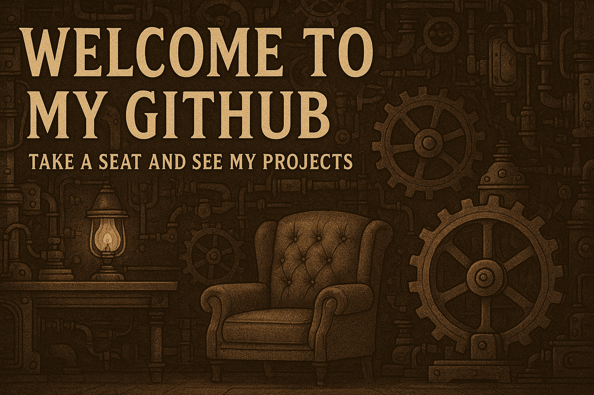

  

<h1 align="center"> ⚙ Hello there! 🔧</h1>

  <i>I'm a developer passionate about code, challenges, and cars!</i>

## ⁉ About Me
- 💻 Full Stack Developer focused on desktop and web applications [+3 years EXP]
- ⚙️ Technologies: ReactJS, .NET C#, PostgreSQL, Electron, Tauri and more...
- 📱 Building responsive solutions for mobile and desktop
- 📈 Passionate about technology, organization, and clean code practices
- 🚀 Always learning something new and applying it in real-world projects
  

## ✨ Fun Facts
- ⚡️ Naturally curious and addicted to solving other people’s problems (that’s why I’m in tech 😵)
- 🎮 Gamer at heart and clearly into that steampunk vibe, as you can see from this profile
- 💬 YES, I’m missing half of an eyebrow XD
- 🚗 Totally obsessed with the automotive world

  

 
  
  
  

##
  
 
 
    
     
  

  
